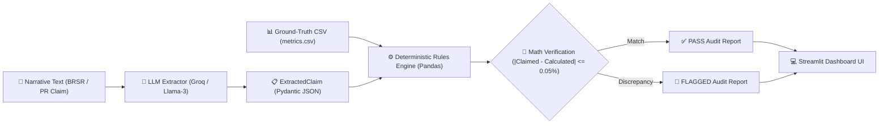

# 🛡️ ClaimGuard — Deterministic ESG & BRSR Audit Engine

> **Built for Prasunethon 2.0 Hackathon (Round 2)**  
> *Eliminating the ESG "greenwashing trap" by pairing LLM semantic claim extraction with pure Python deterministic mathematical verification.*

---

## 📌 Executive Summary

Corporate sustainability reports (**BRSR / ESG disclosures**) combine qualitative marketing narrative (PR claims) with quantitative tabular metrics (CSVs/Excel sheets). 

Traditional AI audit tools frequently fail because **Large Language Models (LLMs) hallucinate arithmetic**. When asked to audit a 50-page report, an LLM might read a PR headline claiming a **"20% reduction in carbon emissions"** and accept it at face value—ignoring the underlying spreadsheet that proves emissions only fell by **2.59%**.

**ClaimGuard** solves this by enforcing a **hybrid deterministic architecture**:
1. **The LLM is strictly restricted to semantic entity extraction** into Pydantic JSON schemas. **Math is forbidden.**
2. **Pure Python & Pandas execute exact arithmetic**, dynamically mapping claim baseline/target years to CSV headers and flagging discrepancies.

---

## 🎯 The Problem: Greenwashing & LLM Math Hallucinations

| Issue | Standard LLM Wrappers | ClaimGuard Deterministic Engine |
| :--- | :--- | :--- |
| **Arithmetic Reliability** | ❌ Hallucinates percentage deltas & baseline calculations | ✅ 100% deterministic pure Python math (Pandas) |
| **Greenwashing Detection** | ❌ Confuses narrative PR statements with ground-truth data | ✅ Compares PR claims against CSV metrics with tolerance check |
| **Schema Integrity** | ❌ Unstructured text outputs | ✅ Strict Pydantic JSON schemas (`ExtractedClaim` & `AuditResult`) |
| **Offline Resilience** | ❌ Crashes without active API access | ✅ Includes zero-config offline regex fallback parser |

---

## 🏗️ Architecture & Data Flow Pipeline



### The 3-Step Audit Pipeline:

1. **Extraction (LLM / Groq API)**:
   - Parses raw narrative text into a structured `ExtractedClaim` schema (`metric`, `claimed_percentage`, `baseline_year`, `target_year`, `claim_text`).
   - Powered by Groq's `llama-3.3-70b-versatile` with strict JSON mode.
   - *Rule*: The LLM is strictly prohibited from verifying or calculating any math.

2. **Verification (Deterministic Rules Engine)**:
   - Dynamically constructs column headers based on extracted years (e.g., `fy23_value`, `fy24_value`, `fy25_value`).
   - Computes exact YoY percentage reduction using pure Python math:
     $$\text{calculated\_delta} = \frac{V_{\text{baseline}} - V_{\text{target}}}{V_{\text{baseline}}} \times 100$$
   - Evaluates variance against a `0.05%` tolerance threshold. If $| \text{claimed} - \text{calculated} | > 0.05\%$, the claim is **FLAGGED**.

3. **Presentation (Streamlit UI)**:
   - Interactive dashboard displaying raw text, extracted JSON, ground-truth metrics tables, visual Pass/Flagged badges, and metric variance cards.

---

## 🛠️ Tech Stack

- **Frontend & UI**: Streamlit 1.30+ (Glassmorphism Dark Theme UI)
- **Data Engine**: Pandas 2.0+ (Tabular CSV Processing & Dynamic Mapping)
- **Data Validation**: Pydantic v2 (Strict Data Contract Enforcement)
- **LLM API**: Groq SDK (`llama-3.3-70b-versatile` / `llama-3.1-8b-instant`)
- **Environment Management**: Python-Dotenv
- **Language**: Python 3.11+

---

## 📁 Project Folder Structure

```
ClaimGuard/
├── data/
│   ├── preset_clean/
│   │   ├── narrative.txt          # Verified 2.59% PR claim
│   │   └── metrics.csv            # FY23 (10,500.00) -> FY24 (10,228.05) = -2.59%
│   └── preset_flagged/
│       ├── narrative.txt          # Fake 20.00% PR claim
│       └── metrics.csv            # FY23 (10,500.00) -> FY24 (10,228.05) = -2.59%
├── src/
│   ├── __init__.py                # Package initialization
│   ├── schemas.py                 # Pydantic models (ExtractedClaim, AuditResult)
│   ├── extractor.py               # Groq LLM JSON parser & offline rule fallback
│   └── rules_engine.py            # Pure Python & Pandas math audit engine
├── .env                           # Environment configuration (GROQ_API_KEY)
├── .gitignore                     # Git exclusion rules
├── app.py                         # Streamlit interactive dashboard UI
├── requirements.txt               # Dependencies list
├── test_audit.py                  # Automated unit test suite
└── README.md                      # Comprehensive project documentation
```

---

## 🧪 Demo Presets & Test Cases

ClaimGuard includes built-in test cases to demonstrate deterministic verification out of the box:

### 🟢 Preset 1: Clean Case (Verified PR Claim)
- **Narrative Claim**: *"Achieved a 2.59% reduction in total Scope 1 & Scope 2 emissions in FY24 compared to FY23."*
- **CSV Data**: FY23 = `10,500.00 MT CO2e`, FY24 = `10,228.05 MT CO2e`
- **Calculated Reduction**: `2.59%`
- **Audit Outcome**: **`✅ PASS`** (Variance: `0.00%`)

### 🔴 Preset 2: Flagged Case (Greenwashing PR Claim)
- **Narrative Claim**: *"Achieved an unprecedented 20.00% reduction in total Scope 1 & Scope 2 emissions in FY24 compared to FY23."*
- **CSV Data**: FY23 = `10,500.00 MT CO2e`, FY24 = `10,228.05 MT CO2e`
- **Calculated Reduction**: `2.59%`
- **Audit Outcome**: **`🚨 FLAGGED`** (Variance: `17.41%`)

### ✍️ Custom Input Mode
- Allows users to type or paste custom PR narrative statements directly into a **300px text area** and upload any ground-truth `metrics.csv` table.

---

## ⚡ Quickstart & Local Installation

### 1. Clone the Repository
```bash
git clone https://github.com/Adityaa10101/ClaimGuard.git
cd ClaimGuard
```

### 2. Create and Activate Virtual Environment (Optional)
```bash
# Windows
python -m venv venv
venv\Scripts\activate

# macOS / Linux
python3 -m venv venv
source venv/bin/activate
```

### 3. Install Dependencies
```bash
pip install -r requirements.txt
```

### 4. Configure Environment Variables
Create or update the `.env` file in the project root directory:
```env
GROQ_API_KEY=gsk_your_actual_groq_api_key_here
```
> *(Note: If no API key is provided, ClaimGuard automatically uses its built-in offline regex fallback parser for zero-config demonstration!)*

### 5. Run Automated Tests
```bash
python test_audit.py
```

### 6. Launch the Streamlit Web Application
```bash
streamlit run app.py
```
Open **http://localhost:8501** in your browser to interact with the dashboard!

---

## 🚀 Future Implementations & Roadmap

To transition ClaimGuard from a hackathon MVP into an enterprise-ready audit software suite, our technical roadmap includes:

1. **📄 Full PDF BRSR Ingestion**:
   - Upgrading from manual text/CSV inputs to a full RAG (Retrieval-Augmented Generation) & OCR extraction pipeline.
   - Autonomously parses and segregates unstructured narrative PR text and embedded quantitative tables directly from 150-page SEBI BRSR PDF filings.

2. **⚡ FastAPI Microservice Deployment**:
   - Decoupling `rules_engine.py` and `extractor.py` from Streamlit to deploy them as a standalone, high-performance REST API microservice (`FastAPI + Uvicorn`).
   - Enables commercial banks, rating agencies, and ESG auditors to integrate ClaimGuard directly into existing ERP systems and risk compliance platforms.

3. **⚖️ Expanded Deterministic Rule Sets**:
   - Adding complex hardcoded Python validation rules for broader SEBI & corporate governance mandates.
   - Audits additional ESG verticals such as Scope 3 value chain emissions, gender pay gap ratios, hazardous waste recycling percentages, and water stress index compliance.

4. **📈 Multi-Year Trend Analysis**:
   - Expanding the Pandas engine to compute 5-year rolling averages and historical trend vectors.
   - Detects systemic, long-term greenwashing patterns (e.g. cherry-picking single-year dips while overall 5-year emissions trend upwards) rather than relying solely on Year-over-Year snapshot comparisons.

---

## 🛡️ License & Acknowledgments

Developed with ❤️ for **Prasunethon 2.0 Hackathon (Round 2)**.

