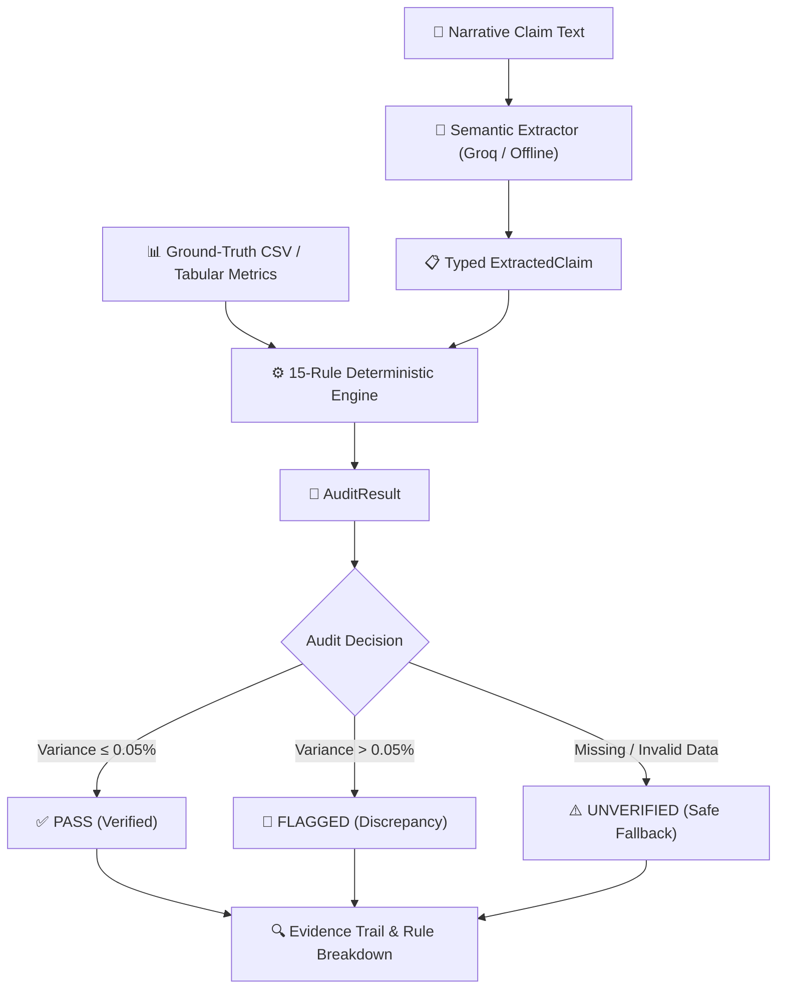

# 🛡️ ClaimGuard

**An AI-assisted ESG/BRSR claim verification system that uses LLMs for semantic claim extraction and deterministic Python rules for mathematical verification.**

> **ClaimGuard uses an LLM to understand sustainability claims, but deterministic Python rules to verify the numbers against ground-truth disclosures.**

```
15 Rules  •  4 Domains  •  FastAPI  •  Docker  •  SEBI BRSR Core
```

---

## ⚡ 10-Second Executive Summary

Corporate sustainability reports (BRSR / ESG filings) combine qualitative PR statements with quantitative tabular disclosures. LLMs are effective at interpreting unstructured sustainability narratives, but arithmetic verification should be deterministic and reproducible.

**ClaimGuard strictly separates responsibilities:**
1. **Semantic Interpretation (LLM)**: Groq / Llama-3 parses natural language into typed Pydantic schemas (`ExtractedClaim`). The LLM executes zero arithmetic.
2. **Deterministic Verification (Python)**: Pure Python and Pandas dynamically resolve fiscal years and evaluate **15 deterministic validation rules** against ground-truth tabular CSV metrics with a strict `0.05%` tolerance threshold.

---

## 🏗️ System Architecture

```
                 ClaimGuard
                      │
          ┌───────────┴───────────┐
          │                       │
     Streamlit UI            FastAPI API
 (Interactive Audit)     (Programmatic Audit)
          │                       │
          └───────────┬───────────┘
                      ↓
                  Extractor
          (Groq Llama-3 / Offline)
                      ↓
        15-Rule Deterministic Engine
         (Emissions, Energy, Water, General)
                      ↓
                 AuditResult
        (PASS / FLAGGED / UNVERIFIED)
```

> **Two interfaces. One verification engine.**
> - **Streamlit UI** provides the interactive audit dashboard.
> - **FastAPI API** exposes the exact same verification engine programmatically.
> - Both interfaces execute the same underlying extraction and verification pipeline directly (Streamlit does not route through FastAPI).

---

## 🔄 Core Audit Pipeline



1. **Narrative Ingestion**: Ingests unstructured ESG text (PR statements, annual letter excerpts).
2. **Schema Extraction**: Groq Llama-3 (or the offline fallback) parses the claim into `ExtractedClaim` (`metric`, `claimed_percentage`, `baseline_year`, `target_year`, `claim_text`).
3. **Dynamic Evidence Resolution**: Resolves metric rows, normalizes aliases, and dynamically matches fiscal year columns (e.g., `fy23_value` → `fy24_value`, `fy24_value` → `fy25_value`).
4. **Deterministic Evaluation**: Evaluates 15 domain rules and computes mathematical variance:
   $$\text{calculated\_delta} = \frac{V_{\text{baseline}} - V_{\text{target}}}{V_{\text{baseline}}} \times 100$$
5. **Structured Audit Output**: Emits a verifiable `AuditResult` with `audit_decision`, `execution_status`, rule rollup summary, and per-rule evidence.

---

## 📐 Current MVP Capabilities

### 1. Claim Extraction
- **Groq Llama-3 Semantic Parser**: Extracts claimed metric, claimed delta, baseline year, and target year into structured JSON schemas.
- **Offline Fallback Parser**: Deterministic regex fallback keeps the audit pipeline usable when Groq is unavailable.

### 2. Ground-Truth Data Ingestion
- **Tabular CSV / DataFrame Input**: Ingests structured disclosures (e.g., SEBI BRSR metric sheets).
- **Metric & Year Resolution**: Normalized alias matching and dynamic N-year column mapping (`FY23`, `FY24`, `FY25`).
- **Data Integrity Handling**: Explicit handling for missing columns, zero-denominator guards, NaN values, and malformed numeric strings.

### 3. 15 Deterministic Validation Rules

| Domain | Rule ID | Rule Name | Evaluation Focus |
| :--- | :--- | :--- | :--- |
| **Emissions** (5) | `EM-01` | Scope 1 & 2 Subtotal Summation | Disclosures subtotal arithmetic integrity |
| | `EM-02` | YoY Percentage Delta Verification | Calculated vs claimed percentage reduction |
| | `EM-03` | Base-Year Restatement Matching | Base-year consistency validation |
| | `EM-04` | Scope 3 Upstream/Downstream Consistency | Category summation vs reported Scope 3 total |
| | `EM-05` | Absolute Metric Ton Variance Check | Absolute mass balance verification |
| **Energy** (4) | `EN-01` | Renewable Energy Ratio Verification | Renewable percentage of total energy consumption |
| | `EN-02` | Electricity & Fuel Consumption Totals | Fuel + Grid electricity consumption balance |
| | `EN-03` | Captive Power Generation Balance | Generation, consumption, and export reconciliation |
| | `EN-04` | Energy Intensity per Turnover Ratio | Energy per unit revenue / turnover verification |
| **Water** (3) | `WT-01` | Surface vs Groundwater Withdrawal Ratio | Withdrawal source summation check |
| | `WT-02` | Facility Water Recycling Rate | Recycled water volume vs total consumption |
| | `WT-03` | Water Consumption Intensity Boundary | Water consumed per revenue intensity boundary |
| **General** (3) | `GEN-01` | Baseline Year Temporal Alignment | Verifies baseline year precedes target year |
| | `GEN-02` | Metric Unit Scale Consistency | Standardizes units (MT, MWh, KL) across periods |
| | `GEN-03` | Impossibility & Zero-Division Boundary | Catches >100% claims and zero-baseline bounds |

---

## 🧪 Verified Demo Cases

| Test Case | Narrative Claim | Ground Truth Disclosures | Expected Output |
| :--- | :--- | :--- | :--- |
| **Demo A**<br>*(Clean Disclosure)* | *"Achieved a 2.59% reduction in total Scope 1 & Scope 2 GHG emissions in FY24 compared to FY23 baseline."* | `FY23: 10,500.00 MT`<br>`FY24: 10,228.05 MT`<br>`Actual: 2.59%` | **`✅ PASS`**<br>Variance: `0.00%`<br>Decision: `PASS` |
| **Demo B**<br>*(Greenwashing Detected)* | *"Achieved an unprecedented 20.00% reduction in total Scope 1 & Scope 2 GHG emissions in FY24 compared to FY23 baseline."* | `FY23: 10,500.00 MT`<br>`FY24: 10,228.05 MT`<br>`Actual: 2.59%` | **`🚨 FLAGGED`**<br>Variance: `17.41%`<br>Rule: `EM-02` |

---

## ✍️ Custom Input Audit Workflow

ClaimGuard supports custom audits on user-provided data:
1. **Navigate to Verification** (`/audit_preset` or click **Custom Input**).
2. **Enter Claim Text**: Paste any corporate sustainability claim narrative.
3. **Upload CSV**: Provide ground-truth tabular disclosures containing fiscal year columns.
4. **API Key (Optional)**: Input your Groq API key (masked in UI) or leave blank to utilize the deterministic offline fallback extractor.
5. **Run Deterministic Audit**: Receive verified `PASS`, `FLAGGED`, or `UNVERIFIED` findings with complete mathematical evidence.

> **Note on Custom CSVs:** Uploading a CSV provides the quantitative ground-truth evidence against which the narrative claim is evaluated. The extractor interprets the natural-language claim, and Python executes the mathematical proof.

---

## 🔌 FastAPI REST API

ClaimGuard includes a decoupled FastAPI service exposing the verification engine:

### Endpoints

- `GET /health` — Service health and rule registry readiness check.
- `GET /rules` — Dynamically inspect all 15 registered deterministic rules across 4 domains.
- `POST /audit` — Execute an end-to-end deterministic audit from JSON payloads.
- `GET /docs` — Interactive OpenAPI / Swagger UI documentation.

### Example Request (`POST /audit`)

```json
{
  "narrative": "Achieved a 2.59% reduction in total Scope 1 & Scope 2 emissions in FY24 compared to FY23.",
  "metrics": [
    {
      "metric_id": "M001",
      "metric_name": "Total Scope 1 & 2 Emissions",
      "category": "Emissions",
      "unit": "MT CO2e",
      "fy23_value": 10500.0,
      "fy24_value": 10228.05
    }
  ]
}
```

### Example Response *(Demo A Verified)*

```json
{
  "status": "PASS",
  "audit_decision": "PASS",
  "execution_status": "SUCCESS",
  "claimed_percentage": 2.59,
  "calculated_delta": 2.59,
  "variance": 0.0,
  "tolerance": 0.05,
  "matched_metric": "Total Scope 1 & 2 Emissions",
  "baseline_year": "FY23",
  "target_year": "FY24",
  "baseline_value": 10500.0,
  "target_value": 10228.05,
  "discrepancy_reason": "VERIFIED: Claimed reduction of 2.59% for 'Total Scope 1 & 2 Emissions' matches ground-truth CSV delta of 2.59% within 0.05% tolerance (|2.59% - 2.59%| = 0.00%).",
  "summary": {
    "total_rules": 15,
    "passed": 4,
    "flagged": 0,
    "not_applicable": 11,
    "missing_data": 0,
    "invalid_data": 0,
    "error": 0
  }
}
```

---

## 🐳 Docker Deployment

ClaimGuard is containerized with Docker and Docker Compose. Both services share the same image and core verification engine.

```bash
docker compose up --build
```

- **Streamlit Web UI**: [http://localhost:8501](http://localhost:8501)
- **FastAPI API**: [http://localhost:8000](http://localhost:8000)
- **Interactive Swagger Docs**: [http://localhost:8000/docs](http://localhost:8000/docs)

### Environment Variables

Configure via `.env` (copy from `.env.example`):
```env
GROQ_API_KEY=gsk_your_groq_api_key_here
CLAIMGUARD_ALLOWED_ORIGINS=http://localhost:8501,http://localhost:3000,http://localhost:8000
```
*(Never commit real API keys or secrets to version control).*

---

## 🧪 Test Coverage & Verification

ClaimGuard is covered by **167 automated regression and API tests**:

- **15 / 15 Registered Deterministic Rules**: Emissions (5), Energy (4), Water (3), General (3).
- **141 / 141 Backend Regression Tests**:
  - `tests/test_track1_engine.py` (Core engine, registry, aggregator, year resolvers)
  - `tests/test_emissions_rules.py` (EM-01 through EM-05)
  - `tests/test_energy_rules.py` (EN-01 through EN-04)
  - `tests/test_water_rules.py` (WT-01 through WT-03)
  - `tests/test_general_rules.py` (GEN-01 through GEN-03)
  - `tests/test_track3_adversarial.py` (Adversarial edge cases, NaN values, zero-division, malformed headers)
  - `tests/test_extractor.py` (Groq & regex claim parsing)
  - `tests/test_e2e_water.py` (Water recycling & intensity end-to-end flows)
  - `test_audit.py` & `test_dynamic_years.py` (Demo presets and dynamic FY24 → FY25 verification)
- **26 / 26 FastAPI API Tests**:
  - `tests/test_api.py` (Endpoints, schema validations, 422 error handlers, full audit integration)

Run all tests:
```bash
# Run backend regression suites
python test_audit.py
python test_dynamic_years.py
python -m pytest tests/test_track1_engine.py tests/test_emissions_rules.py tests/test_energy_rules.py tests/test_water_rules.py tests/test_general_rules.py tests/test_track3_adversarial.py tests/test_extractor.py tests/test_e2e_water.py -v

# Run FastAPI API test suite
python -m pytest tests/test_api.py -v
```

---

## 📁 Project Structure

```
ClaimGuard/
├── api/
│   ├── __init__.py                # API package init
│   ├── main.py                    # FastAPI app, endpoints (/health, /rules, /audit)
│   └── schemas.py                 # Pydantic request/response API contracts
├── src/
│   ├── __init__.py                # Core package init
│   ├── extractor.py               # Groq LLM extraction & deterministic offline fallback
│   ├── rules_engine.py            # Verification pipeline & metric-year mapping
│   ├── schemas.py                 # Core domain models (ExtractedClaim, AuditResult)
│   └── rules/
│       ├── __init__.py            # Rules package init & auto-discovery
│       ├── aggregator.py          # Multi-rule result aggregator
│       ├── base.py                # BaseRule abstract class & evaluation context
│       ├── emissions.py           # Emissions rules (EM-01 to EM-05)
│       ├── energy.py              # Energy rules (EN-01 to EN-04)
│       ├── general.py             # General mathematical rules (GEN-01 to GEN-03)
│       ├── metric_resolver.py     # Metric alias matching & normalizer
│       ├── registry.py            # Central rule registry
│       ├── water.py               # Water rules (WT-01 to WT-03)
│       └── year_resolver.py       # Dynamic fiscal-year column mapper
├── data/
│   ├── preset_clean/              # Demo A clean narrative & tabular CSV
│   ├── preset_flagged/            # Demo B greenwashed narrative & tabular CSV
│   └── fixtures/                  # Extended domain CSV fixtures
├── tests/
│   ├── test_api.py                # 26 FastAPI endpoint tests
│   ├── test_e2e_water.py          # Water domain E2E flow tests
│   ├── test_emissions_rules.py    # Emissions rule suite
│   ├── test_energy_rules.py       # Energy rule suite
│   ├── test_extractor.py          # Extractor validation tests
│   ├── test_general_rules.py      # General rules suite
│   ├── test_rule_registry.py      # Registry unit tests
│   ├── test_track1_engine.py      # Core engine unit tests
│   ├── test_track3_adversarial.py # Adversarial edge case tests
│   └── test_water_rules.py        # Water rule suite
├── .dockerignore                  # Docker build exclusions
├── .env.example                   # Environment variable template
├── .gitignore                     # Git exclusion rules
├── app.py                         # Streamlit SPA interactive dashboard
├── docker-compose.yml             # Two-service stack configuration (UI + API)
├── Dockerfile                     # Shared Python container image for API + UI
├── DOCKER.md                      # Container deployment instructions
├── README.md                      # Comprehensive project documentation
├── requirements.txt               # Pinned Python dependencies
├── test_audit.py                  # Standalone audit verification script
└── test_dynamic_years.py          # Dynamic year transition test script
```

---

## 🚀 Quickstart

### 1. Local Setup

```bash
# Clone the repository
git clone https://github.com/Adityaa10101/ClaimGuard.git
cd ClaimGuard

# Create and activate virtual environment
python -m venv venv
# Windows: venv\Scripts\activate
# Linux/macOS: source venv/bin/activate

# Install dependencies
pip install -r requirements.txt
```

### 2. Launch Streamlit UI
```bash
streamlit run app.py
```
Open **[http://localhost:8501](http://localhost:8501)** in your browser.

### 3. Launch FastAPI Server
```bash
uvicorn api.main:app --reload --port 8000
```
Explore docs at **[http://localhost:8000/docs](http://localhost:8000/docs)**.

### 4. Or Run via Docker
```bash
docker compose up --build
```

---

## 🎯 Core Design Philosophy

> **"The LLM is responsible for semantic interpretation, not arithmetic truth."**

- **Semantic Understanding**: LLMs excel at parsing complex, multi-sentence PR text into structured entity representations.
- **Mathematical Integrity**: Pure Python and Pandas calculate exact deltas, unit ratios, and threshold variances deterministically.
- **Reproducibility**: Identical disclosures and claims yield identical audit outputs every single time.
- **Honest Fallbacks**: Missing disclosures, non-numeric values, or unknown metrics result in `UNVERIFIED` or `MISSING_DATA` states rather than false greenwashing accusations.

---

## ⚠️ Current Limitations

- **Structured CSV Expectation**: The current MVP requires ground-truth tabular disclosures in CSV/DataFrame format.
- **Schema Boundary**: Some specialized rule types (e.g. `EM-03`, `EM-05`) return `NOT_APPLICABLE` when the narrative claim does not provide specific base-year restatement entities.
- **Direct Engine Binding**: Streamlit currently executes verification via direct Python imports from `src/` rather than querying `http://localhost:8000` over HTTP.
- **PDF Ingestion**: Automatic parsing of 150-page annual BRSR PDF filings is slated for the upcoming development phase.

---

## 🔮 Roadmap / Next Phase

### 🚀 Upcoming Feature: PDF Auto-Audit *(Next Phase)*

The primary focus of the next development phase is the **PDF Auto-Audit Pipeline**:
- **Automated BRSR PDF Ingestion**: Ingest native 150-page corporate sustainability reports (e.g. Tata Motors BRSR).
- **Multimodal Document Parsing**: Extract unstructured narrative claims and embedded disclosure tables directly from PDF pages.
- **Claim-to-Evidence Discovery**: Automatically match narrative statements with corresponding quantitative data rows.
- **Provenance & Source Citation**: Provide page-level and table-level visual audit citations for every evaluated claim.
- **Batch Report Verification**: Run the full suite of 15 deterministic rules across every discovered claim in a single report pass.

---

## 🏆 Why ClaimGuard?

1. **Deterministic Accuracy**: Eliminates arithmetic uncertainty through pure Python rule validation.
2. **15 Deterministic Validation Rules**: Comprehensive coverage across Emissions, Energy, Water, and General boundaries.
3. **Explicit Decision Taxonomy**: Clear separation between `PASS`, `FLAGGED`, and `UNVERIFIED` states.
4. **Dual Interface Support**: Interactive Streamlit UI for auditors and REST API for enterprise ERP integrations.
5. **Offline Resilience**: Deterministic fallback extraction keeps the audit pipeline usable when Groq is unavailable.

---

## 📜 License & Acknowledgments

Developed with ❤️ for **Prasunethon 2.0 Hackathon**.
