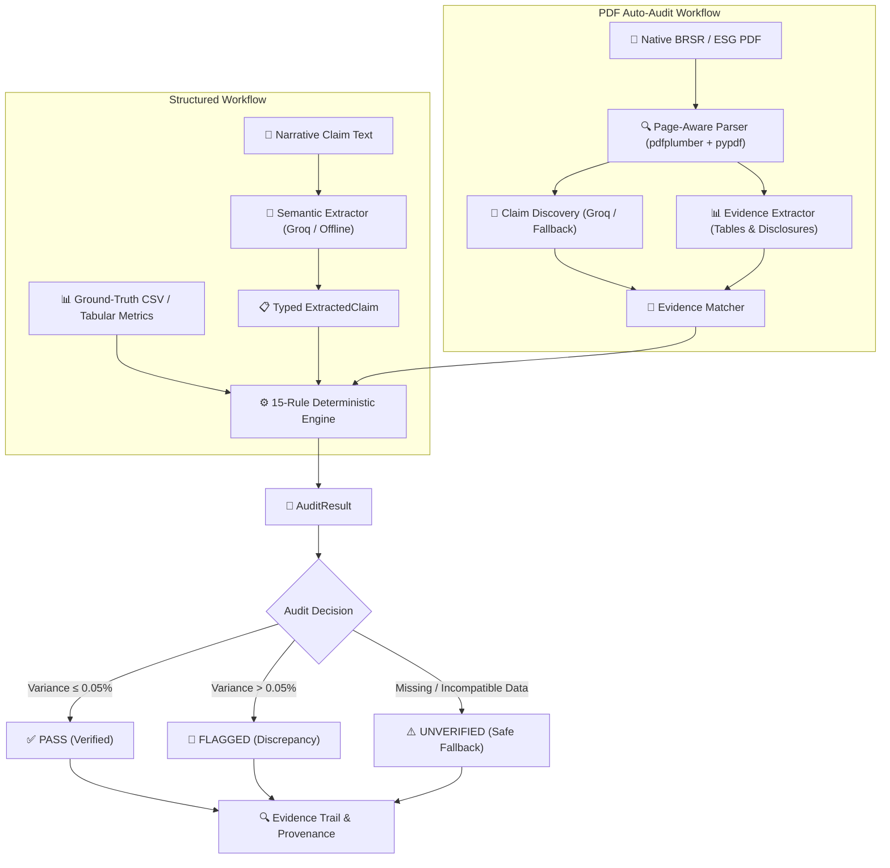

# 🛡️ ClaimGuard

**An AI-assisted ESG/BRSR claim verification system that uses LLMs for semantic claim extraction and deterministic Python rules for mathematical verification against source disclosures. It supports structured CSV audits and real-world PDF Auto-Audit with page-level provenance.**

> **ClaimGuard uses an LLM to understand sustainability claims, but deterministic Python rules to verify the numbers against ground-truth disclosures.**

```
15 Rules  •  4 Domains  •  PDF Auto-Audit  •  FastAPI  •  Docker  •  SEBI BRSR / ESG
```

---

## ⚡ 10-Second Executive Summary

Corporate sustainability reports (BRSR / ESG filings) combine qualitative narrative statements with quantitative tabular disclosures. LLMs are effective at interpreting unstructured sustainability narratives, but arithmetic verification should be deterministic and reproducible.

**ClaimGuard strictly separates responsibilities:**
1. **Semantic Interpretation (LLM)**: Groq / Llama-3 (or deterministic offline fallback) discovers and structures explicit claims into typed Pydantic schemas (`ExtractedClaim`, `ClaimCandidate`). The LLM executes zero arithmetic.
2. **Deterministic Verification (Python)**: Pure Python and Pandas dynamically resolve fiscal years and evaluate **15 deterministic validation rules** against ground-truth disclosures with a strict `0.05%` tolerance threshold.
3. **PDF Evidence & Provenance**: The page-aware PDF pipeline resolves source evidence, distinguishes between directly reported and derived disclosures, and tracks exact page provenance directly from native BRSR reports.

---

## 🏗️ System Architecture

```
                 ClaimGuard
                      │
          ┌───────────┴───────────┐
          │                       │
   Structured Input             PDF Input
   CSV / DataFrame           BRSR / ESG PDF
          │                       │
          │                 Page-aware Parser
          │                       │
          │                Claim Discovery
          │                       │
          └──────────┬────────────┘
                     ↓
               Evidence Matching
                     ↓
          15-Rule Deterministic Engine
         (Emissions, Energy, Water, General)
                     ↓
                 AuditResult
         (PASS / FLAGGED / UNVERIFIED)
```

> **Two interfaces. One verification engine.**
> - **Streamlit UI** provides the interactive audit dashboard (supporting both Custom CSV audits and PDF Auto-Audit).
> - **FastAPI API** exposes the verification engine programmatically for enterprise integrations.
> - Both interfaces execute the same shared underlying Python verification engine directly (Streamlit invokes the engine directly and does not route through FastAPI).

---

## 🔄 Core Audit Pipeline



### Structured Workflow
1. **Narrative Ingestion**: Ingests unstructured ESG text (PR statements, annual letter excerpts).
2. **Schema Extraction**: Groq Llama-3 (or deterministic offline fallback) parses the claim into `ExtractedClaim` (`metric`, `claimed_percentage`, `baseline_year`, `target_year`, `claim_text`).
3. **Dynamic Evidence Resolution**: Resolves metric rows, normalizes aliases, and dynamically matches fiscal year columns (`fy23_value`, `fy24_value`, `fy25_value`).
4. **Deterministic Evaluation**: Evaluates 15 domain rules and computes mathematical variance:
   $$\text{calculated\_delta} = \frac{V_{\text{baseline}} - V_{\text{target}}}{V_{\text{baseline}}} \times 100$$
5. **Structured Audit Output**: Emits a verifiable `AuditResult` with `audit_decision`, `execution_status`, rule rollup summary, and per-rule evidence.

### PDF Auto-Audit Workflow
1. **Native PDF Parsing**: Page-aware document ingestion (`pdfplumber` + `pypdf`) extracts text coordinates, page boundaries, and structural disclosure tables.
2. **Claim Discovery**: Discovers quantitative sustainability claims using Groq/Llama or deterministic regex fallback without requiring manual CSV conversion.
3. **Evidence Extraction**: Extracts structured disclosure tables across environmental and social domains with strict entity and metric boundaries.
4. **Evidence Matching**: Reconciles discovered claims against extracted evidence using metric alias mapping, entity boundary matching (e.g., standalone vs consolidated), and fiscal-year alignment.
5. **Deterministic Verification**: Routes matched evidence through the 15-rule deterministic engine.
6. **Provenance Trail**: Emits an `AuditResult` or `PDFAuditResult` containing exact page citations, raw disclosed strings, and evidence classification (`SOURCE_REPORTED` vs `DERIVED`).

---

## 📄 PDF Auto-Audit

ClaimGuard can ingest supported corporate BRSR/ESG PDF filings directly and discover quantitative claims without requiring the user to manually build or format a CSV file first.

The PDF Auto-Audit pipeline executes the following stages:
1. **Page-Aware PDF Ingestion**: Uses `pdfplumber` and `pypdf` to extract page text, tabular boundaries, and structural metadata across all document pages while preserving page-level provenance.
2. **Semantic Claim Discovery**: Groq/Llama-3 scans disclosure text chunks to identify explicitly stated quantitative claims, reporting periods, and claimed percentage changes.
3. **Deterministic Offline Fallback**: When Groq is unavailable, unconfigured, or fails, a multi-pattern regex engine discovers explicit percentage claims directly from parsed page text.
4. **Entity, Metric & Year Matching**: Maps discovered claim candidates to corporate entities (e.g., standalone vs subsidiaries), standardized metric taxonomies, and reporting periods.
5. **Evidence Resolution & Page Provenance**: Locates exact supporting disclosure tables, linking each data point back to its source page and raw disclosed string.
6. **Deterministic Verification**: Evaluates the matched evidence against the 15 registered validation rules.
7. **Controlled Outcome**: Emits reproducible `PASS`, `FLAGGED`, or `UNVERIFIED` results with mathematical evidence and source citations whenever verification is successfully completed.

> **Note on Scope**: The current PDF Auto-Audit implementation is a validated vertical slice (demonstrated on real-world filings like Tata Motors FY2024–25 BRSR), rather than universal document-wide support for all arbitrary PDF formats.

---

## 🛡️ Evidence Safety & Provenance

ClaimGuard enforces strict provenance and semantic typing on all evidence extracted from PDF documents:

### `SOURCE_REPORTED` Evidence
A value directly and explicitly disclosed within the source document (e.g., reported Scope 1 mass in a standardized BRSR table).

### `DERIVED` Evidence
A value mathematically reconstructed from source-reported inputs (e.g., subtotal summations or calculated intensity ratios).

### Safety Principles:
- **Never Conflate**: `DERIVED` values are never presented as directly reported disclosures.
- **Page-Level Provenance**: Source page numbers (`source_page`) and section titles are retained throughout the entire audit lifecycle.
- **Raw Disclosed Strings**: Original numeric strings (including comma separators and footnote markings) are preserved alongside parsed floats for full auditor transparency.
- **Zero Evidence Substitution**: Unrelated evidence is never substituted to force a calculation.
- **Controlled Fallback**: Ambiguous, missing, or incompatible evidence strictly produces a controlled `UNVERIFIED` outcome rather than guessing.

### Unit Compatibility & Safety (Tata Motors Case Study):
In the Tata Motors FY2024–25 BRSR filing (Page 88):
- **Scope 1** is reported in **`tCO2e`** (metric tonnes of CO2 equivalent).
- **Scope 2** is reported in **`tCO2`** (metric tonnes of CO2).

When the source document provides no explicit, authoritative normalization basis to bridge `tCO2e` and `tCO2`, ClaimGuard **refuses** to assume 1:1 unit equivalence or force an arbitrary combined summation. The audit safely and deterministically returns **`UNVERIFIED`** with an explicit unit incompatibility warning. This is intentional safety behavior to prevent erroneous compliance judgements.

---

## 🔎 Real-World PDF Validation — Tata Motors FY2024–25 BRSR

ClaimGuard has been validated against the official **Tata Motors Limited (TML) FY2024–25 Voluntary BRSR Report** (117-page filing).

- **Source Document**: Tata Motors FY2024–25 BRSR (117 pages)
- **Validated Source Page**: Page 88 (Essential Indicator 7 — Greenhouse Gas Emissions)
- **Target Entity**: Tata Motors Limited (TML Standalone)

| Scenario | Scope / Metric | Source Evidence (Page 88) | Claim Narrative (Controlled Test) | Calculated Delta | Variance | Audit Decision | Evidence Type |
| :--- | :--- | :--- | :--- | :--- | :--- | :--- | :--- |
| **Scenario 1: Scope 1 (Clean)** | Scope 1 Emissions | `FY24: 48,736 tCO2e`<br>`FY25: 43,754 tCO2e` | *"Tata Motors Limited reduced Scope 1 emissions by 10.22% between FY24 and FY25."* | `10.22%` | `0.00%` | **`✅ PASS`** | `SOURCE_REPORTED`<br>(Page 88) |
| **Scenario 2: Scope 1 (Flagged)** | Scope 1 Emissions | `FY24: 48,736 tCO2e`<br>`FY25: 43,754 tCO2e` | *"Tata Motors Limited achieved an aggressive 25.00% reduction in Scope 1 emissions in FY25."* | `10.22%` | `14.78%` | **`🚨 FLAGGED`** | `SOURCE_REPORTED`<br>(Page 88) |
| **Scenario 3: Scope 1 + 2 (Unit Boundary)** | Combined Scope 1 & 2 | `Scope 1: 48,736 -> 43,754 tCO2e`<br>`Scope 2: 172,409 -> 131,407 tCO2` | *"Tata Motors Limited reduced combined Scope 1 and Scope 2 emissions by 20.80% in FY25."* | `N/A (Incompatible Units)` | `N/A` | **`⚠️ UNVERIFIED`** | `UNIT_INCOMPATIBILITY`<br>(tCO2e vs tCO2) |

> **Important Clarification on Test Claims:**
> Scenarios 1 and 2 represent **controlled verification scenarios** engineered to test the deterministic engine against real, extracted Page 88 Tata Motors disclosures. They demonstrate the system's ability to verify genuine claims (`PASS`) and catch exaggerated claims (`FLAGGED`). Scenario 3 demonstrates strict unit safety by refusing to force un-normalized arithmetic.

---

## 📐 Current MVP Capabilities

### 1. Claim Extraction
- **Groq Llama-3 Semantic Parser**: Extracts claimed metric, claimed delta, baseline year, and target year into structured JSON schemas (`ExtractedClaim`, `ClaimCandidate`).
- **Deterministic Offline Fallback**: Multi-pattern regex parsing ensures the extraction pipeline remains fully functional when Groq is unconfigured or unreachable.
- **Structured Representation**: Typed Pydantic models preserve claim text, entity boundaries, and reporting periods.

### 2. Structured Evidence (CSV / DataFrame)
- **Tabular Data Ingestion**: Ingests structured CSV metric disclosures (e.g., SEBI BRSR indicator sheets).
- **Metric Alias & Synonym Resolution**: Maps variations (`"Scope 1"`, `"GHG Scope 1"`, `"Direct Emissions"`) to canonical schema keys.
- **Dynamic Fiscal-Year Column Mapping**: Resolves arbitrary sequential periods (`FY23` → `FY24`, `FY24` → `FY25`).
- **Data Integrity Guards**: Strict handling for missing columns, zero-denominator boundaries, NaN values, and malformed numeric strings.

### 3. PDF Evidence & Provenance
- **Page-Aware Parsing**: Native PDF ingestion via `pdfplumber` and `pypdf` with page coordinate awareness.
- **Table & Disclosure Extraction**: Automated boundary detection for environmental metrics.
- **Source-Page Provenance**: Every extracted value retains its originating page number and section context.
- **Automated Claim Discovery**: Semantic and regex-based discovery of quantitative statements directly from report text.
- **Evidence Classification**: Strict distinction between `SOURCE_REPORTED` disclosures and `DERIVED` metrics.

### 4. Deterministic Validation Engine
- **15 Registered Rules**: Broad domain coverage across Emissions, Energy, Water, and General arithmetic sanity.
- **Explicit Multi-State Decision & Rule Taxonomy**: Clear distinction between Audit Decision (`PASS`, `FLAGGED`, `UNVERIFIED`), Execution Status (`SUCCESS`, `MISSING_DATA`, `INVALID_DATA`, `ERROR`), and rule-level evaluation status (including `NOT_APPLICABLE` where appropriate).
- **Strict Mathematical Tolerance**: Configurable `0.05%` variance threshold.

---

## 📋 15 Deterministic Validation Rules

| Domain | Rule ID | Rule Name | Evaluation Focus |
| :--- | :--- | :--- | :--- |
| **Emissions** (5) | `EM-01` | Scope 1 & 2 Subtotal Summation | Disclosures subtotal arithmetic integrity |
| | `EM-02` | YoY Percentage Delta Verification | Calculated vs claimed percentage reduction |
| | `EM-03` | Base-Year Restatement Matching | Base-year consistency validation |
| | `EM-04` | Scope 3 Upstream/Downstream Consistency | Category summation vs reported Scope 3 total |
| | `EM-05` | Absolute Metric Ton Variance Check | Absolute mass balance verification |
| **Energy** (4) | `EN-01` | Renewable Energy Ratio Verification | Renewable percentage of total energy consumption |
| | `EN-02` | Electricity & Fuel Consumption Totals | Fuel + Grid electricity consumption balance |
| | `EN-03` | Captive Power Generation Balance | Generation, consumption, and export reconciliation |
| | `EN-04` | Energy Intensity per Turnover Ratio | Energy per unit revenue / turnover verification |
| **Water** (3) | `WT-01` | Surface vs Groundwater Withdrawal Ratio | Withdrawal source summation check |
| | `WT-02` | Facility Water Recycling Rate | Recycled water volume vs total consumption |
| | `WT-03` | Water Consumption Intensity Boundary | Water consumed per revenue intensity boundary |
| **General** (3) | `GEN-01` | Baseline Year Temporal Alignment | Verifies baseline year precedes target year |
| | `GEN-02` | Metric Unit Scale Consistency | Standardizes units (MT, MWh, KL) across periods |
| | `GEN-03` | Impossibility & Zero-Division Boundary | Catches >100% claims and zero-baseline bounds |

---

## 🧪 Verified Demo Cases

| Test Case | Narrative Claim | Ground Truth Disclosures | Expected Output |
| :--- | :--- | :--- | :--- |
| **Demo A**<br>*(Clean Disclosure)* | *"Achieved a 2.59% reduction in total Scope 1 & Scope 2 GHG emissions in FY24 compared to FY23 baseline."* | `FY23: 10,500.00 MT`<br>`FY24: 10,228.05 MT`<br>`Actual: 2.59%` | **`✅ PASS`**<br>Variance: `0.00%`<br>Decision: `PASS` |
| **Demo B**<br>*(Greenwashing Detected)* | *"Achieved an unprecedented 20.00% reduction in total Scope 1 & Scope 2 GHG emissions in FY24 compared to FY23 baseline."* | `FY23: 10,500.00 MT`<br>`FY24: 10,228.05 MT`<br>`Actual: 2.59%` | **`🚨 FLAGGED`**<br>Variance: `17.41%`<br>Rule: `EM-02` |

> **Note on Demo Cases:** These are controlled structured-data demonstrations of the core deterministic engine. For real-world PDF-based validation, see the [Tata Motors FY2024–25 Case Study](#-real-world-pdf-validation--tata-motors-fy202425-brsr) above.

---

## ✍️ Custom Input Audit Workflow

ClaimGuard supports two primary audit workflows:
1. **Structured Custom Input**: Audit user-supplied narrative claims against structured CSV/DataFrame ground-truth tables.
2. **PDF Auto-Audit**: Audit discovered claims against page-aware PDF disclosures extracted directly from BRSR filings.

### Running a Structured Custom Audit:
1. **Navigate to Verification** (`/audit_preset` or click **Custom Input**).
2. **Enter Claim Text**: Paste any corporate sustainability claim narrative.
3. **Upload CSV**: Provide ground-truth tabular disclosures containing fiscal year columns.
4. **API Key (Optional)**: Set `GROQ_API_KEY` in your environment or leave blank to utilize the deterministic offline fallback extractor.
5. **Run Deterministic Audit**: Receive verified `PASS`, `FLAGGED`, or `UNVERIFIED` findings with complete mathematical evidence.

---

## 🔌 FastAPI REST API

ClaimGuard includes a decoupled FastAPI service exposing the verification engine:

### Endpoints

- `GET /health` — Service health and rule registry readiness check.
- `GET /rules` — Dynamically inspect all 15 registered deterministic rules across 4 domains.
- `POST /audit` — Execute an end-to-end deterministic audit from JSON payloads.
- `GET /docs` — Interactive OpenAPI / Swagger UI documentation.

### Example Request (`POST /audit`)

```json
{
  "narrative": "Achieved a 2.59% reduction in total Scope 1 & Scope 2 emissions in FY24 compared to FY23.",
  "metrics": [
    {
      "metric_id": "M001",
      "metric_name": "Total Scope 1 & 2 Emissions",
      "category": "Emissions",
      "unit": "MT CO2e",
      "fy23_value": 10500.0,
      "fy24_value": 10228.05
    }
  ]
}
```

### Example Response *(Demo A Verified)*

```json
{
  "status": "PASS",
  "audit_decision": "PASS",
  "execution_status": "SUCCESS",
  "claimed_percentage": 2.59,
  "calculated_delta": 2.59,
  "variance": 0.0,
  "tolerance": 0.05,
  "matched_metric": "Total Scope 1 & 2 Emissions",
  "baseline_year": "FY23",
  "target_year": "FY24",
  "baseline_value": 10500.0,
  "target_value": 10228.05,
  "discrepancy_reason": "VERIFIED: Claimed reduction of 2.59% for 'Total Scope 1 & 2 Emissions' matches ground-truth CSV delta of 2.59% within 0.05% tolerance (|2.59% - 2.59%| = 0.00%).",
  "summary": {
    "total_rules": 15,
    "passed": 4,
    "flagged": 0,
    "not_applicable": 11,
    "missing_data": 0,
    "invalid_data": 0,
    "error": 0
  }
}
```

---

## 🐳 Docker Deployment

ClaimGuard is containerized with Docker and Docker Compose. Both services share the same Python container image and core verification engine.

```bash
docker compose up --build
```

- **Streamlit Web UI**: [http://localhost:8501](http://localhost:8501)
- **FastAPI API**: [http://localhost:8000](http://localhost:8000)
- **Interactive Swagger Docs**: [http://localhost:8000/docs](http://localhost:8000/docs)

### Environment Variables

Configure via `.env` (copy from `.env.example`):
```env
GROQ_API_KEY=gsk_your_groq_api_key_here
CLAIMGUARD_ALLOWED_ORIGINS=http://localhost:8501,http://localhost:3000,http://localhost:8000
```
*(Never commit real API keys or secrets to version control. When `GROQ_API_KEY` is not provided, ClaimGuard automatically uses its deterministic offline fallback).*

---

## 🧪 Test Coverage & Verification

ClaimGuard is covered by **235 automated tests** (0 failed):

- **15 / 15 Registered Deterministic Rules**: Emissions (5), Energy (4), Water (3), General (3).
- **Core Engine & Rule Suites**:
  - `tests/test_track1_engine.py` (Core engine, registry, aggregator, year resolvers)
  - `tests/test_rule_registry.py` (Registry initialization and rule discovery)
  - `tests/test_emissions_rules.py` (EM-01 through EM-05)
  - `tests/test_energy_rules.py` (EN-01 through EN-04)
  - `tests/test_water_rules.py` (WT-01 through WT-03)
  - `tests/test_general_rules.py` (GEN-01 through GEN-03)
  - `tests/test_track3_adversarial.py` (Adversarial edge cases, NaN values, zero-division, malformed headers)
  - `tests/test_extractor.py` (Groq & regex claim parsing)
  - `tests/test_e2e_water.py` (Water recycling & intensity end-to-end flows)
  - `test_audit.py` & `test_dynamic_years.py` (Demo presets and dynamic FY24 → FY25 verification)
- **PDF Ingestion, Discovery & Audit Suites**:
  - `tests/test_pdf_ingestion.py` (Page parsing, table boundary extraction, number cleaning, year normalization)
  - `tests/test_pdf_claim_discovery.py` (Groq semantic discovery, fallback regex extraction, entity boundaries, chunking)
  - `tests/test_pdf_audit_e2e.py` (End-to-end Tata Motors BRSR verification: Scope 1 PASS/FLAGGED, Scope 2, unit-safety UNVERIFIED)
  - `tests/test_pdf_ui.py` (Streamlit PDF UI state, candidate filters, result formatting)
- **FastAPI API Suite**:
  - `tests/test_api.py` (26 tests: endpoints, schemas, 422 error handlers, full audit integration)

Run all tests:
```bash
python -m pytest -q
```

---

## 📁 Project Structure

```
ClaimGuard/
├── api/
│   ├── __init__.py                # API package init
│   ├── main.py                    # FastAPI app, endpoints (/health, /rules, /audit)
│   └── schemas.py                 # Pydantic request/response API contracts
├── src/
│   ├── __init__.py                # Core package init
│   ├── extractor.py               # Groq LLM extraction & deterministic offline fallback
│   ├── rules_engine.py            # Verification pipeline & metric-year mapping
│   ├── schemas.py                 # Core domain models (ExtractedClaim, AuditResult)
│   ├── styles.py                  # UI styling constants & theme definitions
│   ├── pdf/
│   │   ├── __init__.py            # PDF module exports
│   │   ├── audit_runner.py        # PDF claim audit runner & PDFAuditResult
│   │   ├── claim_discovery.py     # Groq & regex claim discovery from PDF text
│   │   ├── claim_models.py        # ClaimCandidate & EntityBoundary models
│   │   ├── evidence_extractor.py  # Structured disclosure table extraction
│   │   ├── evidence_matcher.py    # Claim-to-evidence matching & reconciliation
│   │   ├── models.py              # ParsedDocument, DocumentPage, ExtractedEvidence
│   │   └── parser.py              # pdfplumber + pypdf page-aware parser
│   └── rules/
│       ├── __init__.py            # Rules package init & auto-discovery
│       ├── aggregator.py          # Multi-rule result aggregator
│       ├── base.py                # BaseRule abstract class & evaluation context
│       ├── emissions.py           # Emissions rules (EM-01 to EM-05)
│       ├── energy.py              # Energy rules (EN-01 to EN-04)
│       ├── general.py             # General mathematical rules (GEN-01 to GEN-03)
│       ├── metric_resolver.py     # Metric alias matching & normalizer
│       ├── registry.py            # Central rule registry
│       ├── water.py               # Water rules (WT-01 to WT-03)
│       └── year_resolver.py       # Dynamic fiscal-year column mapper
├── data/
│   ├── preset_clean/              # Demo A clean narrative & tabular CSV
│   ├── preset_flagged/            # Demo B greenwashed narrative & tabular CSV
│   └── fixtures/                  # Extended domain CSV fixtures & PDF files
├── tests/
│   ├── test_api.py                # 26 FastAPI endpoint tests
│   ├── test_e2e_water.py          # Water domain E2E flow tests
│   ├── test_emissions_rules.py    # Emissions rule suite
│   ├── test_energy_rules.py       # Energy rule suite
│   ├── test_extractor.py          # Extractor validation tests
│   ├── test_general_rules.py      # General rules suite
│   ├── test_pdf_audit_e2e.py      # End-to-end PDF audit tests (Tata Motors BRSR)
│   ├── test_pdf_claim_discovery.py# PDF claim discovery tests (Groq + fallback)
│   ├── test_pdf_ingestion.py      # PDF parsing & evidence extraction tests
│   ├── test_pdf_ui.py             # PDF Streamlit UI component tests
│   ├── test_rule_registry.py      # Registry unit tests
│   ├── test_track1_engine.py      # Core engine unit tests
│   ├── test_track3_adversarial.py # Adversarial edge case tests
│   └── test_water_rules.py        # Water rule suite
├── .dockerignore                  # Docker build exclusions
├── .env.example                   # Environment variable template
├── .gitignore                     # Git exclusion rules
├── app.py                         # Streamlit SPA interactive dashboard
├── docker-compose.yml             # Two-service stack configuration (UI + API)
├── Dockerfile                     # Shared Python container image for API + UI
├── DOCKER.md                      # Container deployment instructions
├── PROJECT_STATE.md               # Master technical reference & architecture log
├── PROJECT_STATUS.md              # Operational status & health report
├── README.md                      # Comprehensive project documentation
├── requirements.txt               # Pinned Python dependencies
├── test_audit.py                  # Standalone audit verification script
└── test_dynamic_years.py          # Dynamic year transition test script
```

---

## 🚀 Quickstart

### 1. Local Setup

```bash
# Clone the repository
git clone https://github.com/Adityaa10101/ClaimGuard.git
cd ClaimGuard

# Create and activate virtual environment
python -m venv venv
# Windows: venv\Scripts\activate
# Linux/macOS: source venv/bin/activate

# Install dependencies
pip install -r requirements.txt
```

### 2. Launch Streamlit UI
```bash
streamlit run app.py
```
Open **[http://localhost:8501](http://localhost:8501)** in your browser.

### 3. Launch FastAPI Server
```bash
uvicorn api.main:app --reload --port 8000
```
Explore docs at **[http://localhost:8000/docs](http://localhost:8000/docs)**.

### 4. Or Run via Docker
```bash
docker compose up --build
```

---

## 🎯 Core Design Philosophy

> **"The LLM is responsible for semantic interpretation, not arithmetic truth."**

- **Semantic Understanding**: LLMs excel at parsing complex, multi-sentence PR text and discovering quantitative statements in unstructured disclosures.
- **Mathematical Integrity**: Pure Python and Pandas calculate exact deltas, unit ratios, and threshold variances deterministically.
- **Reproducibility**: Identical disclosures and claims yield identical audit outputs every single time.
- **Honest Fallbacks**: Missing disclosures, non-numeric values, or unknown metrics result in `UNVERIFIED` or `MISSING_DATA` states rather than false greenwashing accusations.
- **Evidence Provenance**: Audit results track source documents, page numbers, raw disclosed strings, and distinction between direct and derived values.

---

## ⚠️ Current Limitations

- **Vertical Slice Scope**: PDF Auto-Audit is currently implemented as a validated vertical slice for supported BRSR environmental sections rather than universal document-wide coverage across all arbitrary filing formats.
- **Multi-Claim Batch Orchestration**: Discovery identifies individual claim candidates; full multi-claim batch orchestration across all sections in a single pass is future scope.
- **Scanned / Image PDFs**: Ingestion currently processes digital text and vector table layouts; scanned image-only PDFs require OCR integration.
- **Missing / Ambiguous Disclosures**: Discovered quantitative statements lacking unambiguous tabular backing are marked `UNVERIFIED` / `NEEDS EVIDENCE`.
- **Strict Unit Normalization**: Combined claims across differing units (e.g. `tCO2e` and `tCO2`) are safely rejected without document-provided conversion factors.
- **Direct Engine Binding**: Streamlit currently executes verification via direct Python imports from `src/` rather than querying `http://localhost:8000` over HTTP.

---

## 🔮 Roadmap / Next Phase

### Multi-Claim Document Auditing
Automatically audit multiple supported claims from a single BRSR report in a single automated batch pass.

### OCR & Scanned Report Support
Extract disclosures and narrative claims from scanned and image-based sustainability reports.

### Multi-Year Trend Auditing
Detect multi-year anomalies, baseline shifting, and inconsistent sustainability trends across reporting cycles.

---

## 🏆 Why ClaimGuard?

1. **Deterministic Verification**: Eliminates arithmetic uncertainty through pure Python rule validation.
2. **15 Deterministic Validation Rules**: Comprehensive coverage across Emissions, Energy, Water, and General boundaries.
3. **Explicit Decision Taxonomy**: Clear, transparent separation between `PASS`, `FLAGGED`, and `UNVERIFIED` states.
4. **Page-Level PDF Provenance**: Retains source pages, disclosure citations, and raw disclosed strings.
5. **Dual Interface Support**: Interactive Streamlit UI for auditors and REST API for programmatic and future enterprise integrations.
6. **Offline Resilience**: Deterministic fallback extraction keeps the audit pipeline operational without external API dependencies.

---

## 🚀 Live Demo

**Web App:** https://claimguard-prasunethon.streamlit.app/

The hosted deployment uses platform-managed secrets for Groq; no API keys are stored in the repository.

---

## 📜 License & Acknowledgments

Developed with ❤️ for **Prasunethon 2.0 Hackathon**.
